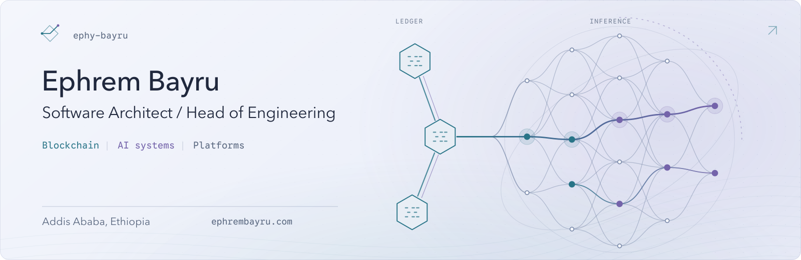

<picture>
  <source media="(max-width: 600px) and (prefers-color-scheme: dark)" srcset="./assets/hero-mobile-dark.svg">
  <source media="(max-width: 600px) and (prefers-color-scheme: light)" srcset="./assets/hero-mobile-light.svg">
  <source media="(prefers-color-scheme: dark)" srcset="./assets/hero-dark.svg">
  <source media="(prefers-color-scheme: light)" srcset="./assets/hero-light.svg">
  
</picture>

  <a href="https://www.ephrembayru.com">Website&nbsp;↗</a> &nbsp; / &nbsp;
  <a href="https://www.linkedin.com/in/ephrem-bayru/">LinkedIn&nbsp;↗</a> &nbsp; / &nbsp;
  <a href="mailto:ephybayru@gmail.com">Email&nbsp;↗</a>

 

## Architecture & engineering

I'm **Ephrem Bayru**, a software architect, head of engineering, and hands-on engineer with **10+ years of experience** across casino platforms, financial products, sportsbook platforms, and business systems.

My work covers **blockchain integrations, AI-assisted products, platform architecture, and technical leadership**. I work across interfaces, services, data, and partner integrations, staying involved from system design through implementation and production delivery.

> **Currently** &nbsp; Software Architect & Head of Engineering at **Expertly**, working on a casino platform.

 

## Selected work

01 / CASINO PLATFORMS

### Casino platform architecture & engineering leadership

At **Expertly**, I work as **Software Architect & Head of Engineering**, leading architecture and engineering for a casino platform.

02 / FINANCIAL SYSTEMS

### Blockchain & financial systems

At **Take SaaS**, I build and maintain cryptocurrency lending and borrowing products, contributing to service architecture, data modeling, blockchain integrations, and performance alongside distributed engineering teams.

03 / PARTNER ECOSYSTEMS

### White-label platforms & partner integrations

At **Gaming Innovation Group**, I contributed to white-label sportsbook platforms and operator tooling, supporting products sold to international betting brands.

 

## Technical leadership

I guide architecture, contribute to delivery planning, and mentor engineers through reviews and technical discussions. My priorities are clear system boundaries, explicit trade-offs, maintainable implementations, and reliable releases.

 

<strong>Experience & education</strong>

### Experience

- **Expertly** · Apr 2025–Present 
  **Current:** Software Architect & Head of Engineering, casino platform. 
  **Previously:** Tech Lead & Software Architect, Betslip.
- **Take SaaS** — Principal Software Development Engineer · May 2022–Present
- **Gaming Innovation Group** — Senior Frontend Engineer · May 2021–2022
- **Excellerent Solutions** — Tech Lead / Senior Full-Stack Developer · Jul 2020–Nov 2021
- **Atlas Computer Technologies** — Senior Web Developer · Mar 2019–Jul 2020
- **AppDiv Systems Development** — Full-Stack Developer · Aug 2017–Mar 2019

### Education

- **Master's in Computer Science** — American College of Technology
- **Bachelor's in Electrical and Computer Engineering** — Hawassa University

Based in **Addis Ababa, Ethiopia**. Outside engineering: reading, football, and documentaries.

 

---

  <a href="mailto:ephybayru@gmail.com">ephybayru@gmail.com</a> &nbsp; · &nbsp; Addis Ababa, Ethiopia

